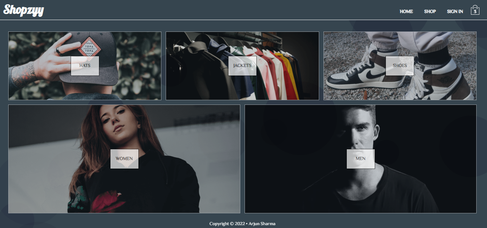
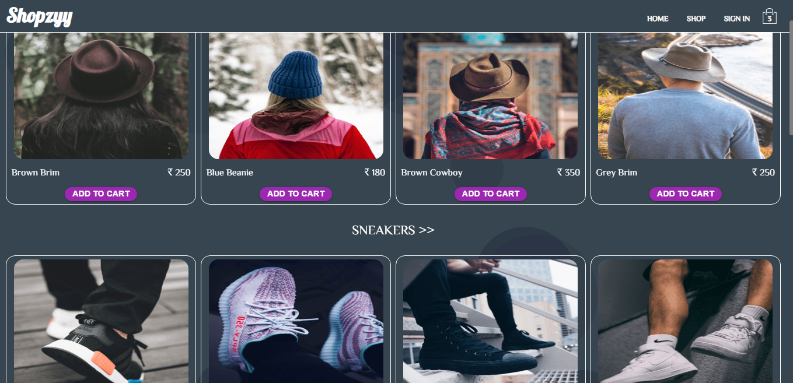
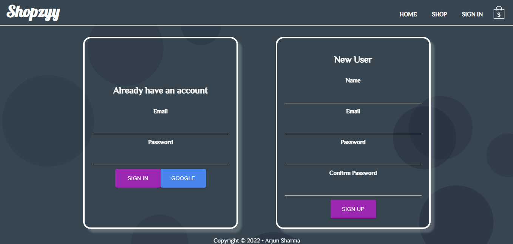
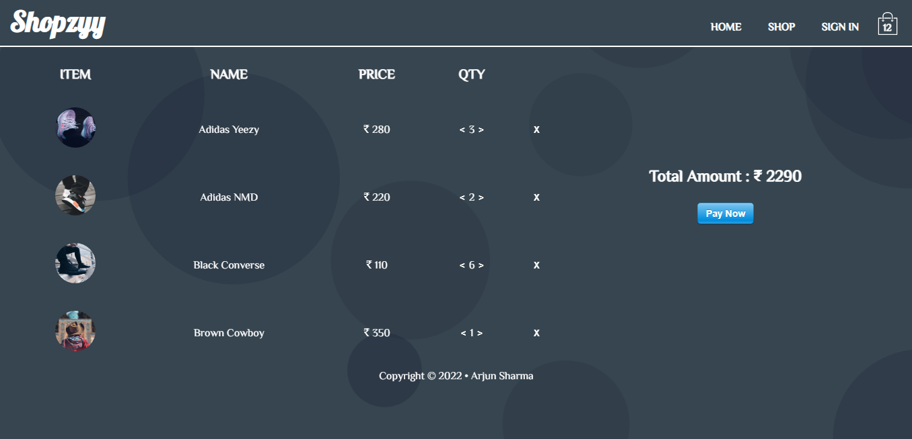

<p align="center">
<h1 align="center">
	<a href="[https://](https://shoppingsite.vercel.app/)"></a>
</h1>

# 🗺 About Shopzyy :
* Shopzyy is a shopping site created with ReactJS & Redux on the frontend.
* Firebase for back-end (Auth, Firestore Database).
* Stripe is used for collecting payments.

</p>
	
# 🚀 Technologies and Frameworks

Shopzyy is built with the following technologies:

- [ReactJS](https://reactjs.org/)
- [Javascript](https://www.javascript.com)
- [Firebase](https://firebase.google.com)
- [Scss](https://sass-lang.com)
- [Stripe](https://stripe.com)
- [Particlejs](https://particles.js.org)

#  📷 Snapshots of the Hosted Projects

<div style="display: flex;">




  </div>

## Starting the Dev Server

- Clone the repository to your local system. `https://github.com/arjunsharma1152/shopping-site`

- Firebase API Setup:

  1.  Go to [Firebase Console](https://console.firebase.google.com) and follow the steps to create a new Firebase project.
  2.  Select `</>` and you will recieve a firebasConfig object with the first paramter as API key. Copy it, which will look something like: 
  	
	```js
              cosnt firebaseConfig = {
              apiKey: "process.env.REACT_APP_FIREBASE",
              authDomain: "AUTH_DOMAIN",
              projectId: "PROJECT_ID",
              storageBucket: "STORAGE_BUCKET",
              messagingSenderId: "*************",
              appId: "******************************",
              measurementId: "*************"
            };
      ```
   3.  Paste and save it in the firebase.js file. 
   
- In the root folder and enter the following commands in the CLI

          npm i or yarn
          npm start or yarn start
